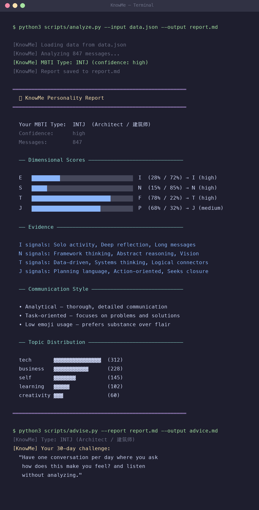

<div align="center">

# 🧬 KnowMe

**Your AI conversations reveal your personality.**

**KnowMe analyzes your ChatGPT / Claude / DeepSeek chat history to uncover your MBTI type, personality strengths & weaknesses, and actionable life advice.**

[](https://www.python.org/downloads/)
[](LICENSE)
[](https://github.com/AIPMAndy/KnowMe/stargazers)
[](https://github.com/AIPMAndy/KnowMe/issues)

**English** | [简体中文](README.md)

<br>



</div>

---

## 💡 The Idea

Traditional MBTI tests ask what you *think* you'd do.

**KnowMe analyzes what you *actually* do** — how you ask questions, how you make decisions, how you structure your thoughts, what topics consume your attention — all extracted from your real conversations with AI.

> **No surveys. No self-reporting bias. Just your authentic behavior.**

Think about it: you've had hundreds (maybe thousands) of conversations with ChatGPT. Those conversations contain your real thinking patterns and personality fingerprint. KnowMe extracts them.

---

## 🆚 Why KnowMe?

| Capability | Traditional MBTI Tests | AI Chat Assessments | **KnowMe** |
|-----------|:---:|:---:|:---:|
| Based on real behavior (not self-report) | ❌ | ❌ | ✅ |
| Supports ChatGPT / Claude / DeepSeek data | ❌ | ❌ | ✅ |
| 50+ behavioral signal detection | ❌ | ❌ | ✅ |
| Bilingual signal detection (EN + CN) | ❌ | Partial | ✅ |
| 100% local — data never leaves your device | ❌ | ❌ | ✅ |
| Confidence scoring per dimension | ❌ | ❌ | ✅ |
| Personalized advice for all 16 types | ✅ | Partial | ✅ |
| Free & open source | ❌ | ❌ | ✅ |

**The core difference: we don't ask you to pick answers. We let your behavior answer for you.**

---

## 🚀 Quick Start (30 seconds)

### Option 1: Command Line (Recommended)

```bash
# Clone the repo
git clone https://github.com/AIPMAndy/KnowMe.git
cd KnowMe

# Analyze your ChatGPT data (export from Settings → Data Controls → Export Data)
python3 scripts/collect.py --source chatgpt --file ~/Downloads/conversations.json --output data.json
python3 scripts/analyze.py --input data.json --output report.md
python3 scripts/advise.py --report report.md --output advice.md

# Read your personality report!
cat report.md
```

### Option 2: As an OpenClaw Skill

```bash
# Install the skill
openclaw skill install knowme

# Then just ask your AI assistant:
# "Analyze my personality from our conversations"
# "What's my MBTI type?"
# "Give me personality insights"
```

---

## 📊 What You Get

### 1. MBTI Type with Confidence Scores

```
Your MBTI Type: INTJ (Architect)

E [██████░░░░░░░░░░░░░░] I  (28% / 72%) → I ⬅️ (high confidence)
S [░░░░░░░░████████████] N  (15% / 85%) → N ⬅️ (high confidence)
T [████████████████░░░░] F  (78% / 22%) → T ⬅️ (high confidence)
J [██████████████░░░░░░] P  (68% / 32%) → J ⬅️ (medium confidence)
```

Each dimension includes:
- 📊 Percentage scores (not binary labels)
- 🎯 Confidence level (high / medium / low)
- 📝 Behavioral evidence (what you said that led to the score)

### 2. Communication Style Analysis

- Message length patterns (are you concise or thorough?)
- Question / exclamation rates
- Emoji usage frequency
- Topic distribution (tech vs business vs relationships vs self-growth)
- Collaborative vs independent tendencies

### 3. Personalized Life Advice

- 💪 **Your Superpowers** — Top 3 strengths
- 🌱 **Growth Edges** — 3 areas most worth developing
- 🎯 **Career Lens** — What roles and work styles fit you
- 💬 **Communication Blind Spots** — Issues you might not notice
- ❤️ **Relationship Insights** — Your social patterns
- ⚡ **30-Day Challenge** — One specific growth experiment

---

## 📦 Supported Data Sources

| Source | Command | How to Export |
|--------|---------|---------------|
| **ChatGPT** | `--source chatgpt --file conversations.json` | Settings → Data Controls → Export Data |
| **Claude** | `--source claude --file claude_export.json` | Settings → Account → Export Data |
| **OpenClaw** | `--source openclaw` | Auto-reads from workspace memory files |
| **Any Text** | `--source text --file ./chats/` | Any .md/.txt files with `User:/Assistant:` markers |

> 💡 **Tip**: More data = better analysis. We recommend 50+ messages. Merging data from multiple platforms gives the best results.

---

## 🔬 How It Works

KnowMe does **not** call any AI API for analysis (that would be slow, expensive, and inconsistent).

Instead, it uses a **signal-based scoring system**:

```
Your chat history → 50+ behavioral signal scan → 8-dimension weighted scoring → MBTI + personality profile
```

### Signal Examples

| What you said | Detected signal | Dimension affected |
|--------------|----------------|-------------------|
| "Let me think about that..." | Needs solo processing time | I +3 |
| "Let's brainstorm together" | Collaborative tendency | E +2 |
| "How exactly do I do this step by step?" | Practical orientation | S +2 |
| "What if we look at it from another angle..." | Abstract thinking | N +2 |
| "The data shows..." | Data-driven reasoning | T +2 |
| "How would this make the team feel?" | People-centered concern | F +2 |
| "What's the next action item?" | Closure-driven | J +2 |
| "It depends, let's stay flexible" | Open adaptability | P +2 |

### Why this approach?

- ⚡ **Fast** — Analyzes 1000+ messages in seconds
- 🔒 **Private** — Zero API calls, data never leaves your device
- 📊 **Explainable** — Every score has traceable behavioral evidence
- 🔄 **Reproducible** — Same input always gives the same output

---

## 🛠️ Advanced Usage

### Merge multiple data sources

```bash
# Collect from multiple sources
python3 scripts/collect.py --source chatgpt --file chatgpt.json --output /tmp/gpt.json
python3 scripts/collect.py --source claude --file claude.json --output /tmp/claude.json

# Merge with jq
jq -s '{messages: (.[0].messages + .[1].messages), source: "merged", total_messages: (.[0].total_messages + .[1].total_messages)}' \
  /tmp/gpt.json /tmp/claude.json > /tmp/merged.json

# Analyze merged data
python3 scripts/analyze.py --input /tmp/merged.json --output report.md
```

### Export raw scores

```bash
python3 scripts/analyze.py --input data.json --output report.md --json raw_scores.json
```

---

## 🏗️ Architecture

```
knowme/
├── README.md                         # 中文文档
├── README_EN.md                      # English docs
├── scripts/
│   ├── collect.py                    # Multi-source data collector
│   ├── analyze.py                    # Signal-based personality analyzer
│   └── advise.py                     # 16-type personalized advice engine
├── references/
│   ├── mbti_signals.md               # Signal taxonomy (50+ signals)
│   └── advice_frameworks.md          # Advice generation frameworks
├── assets/                           # Demo images and media
├── SKILL.md                          # OpenClaw Skill definition
├── CONTRIBUTING.md                   # Contributing guide
└── LICENSE                           # MIT License
```

---

## 🗺️ Roadmap

- [x] Core MBTI 4-dimension analysis
- [x] ChatGPT / Claude / OpenClaw data sources
- [x] Personalized advice for all 16 types
- [x] Bilingual signal detection (EN + CN)
- [x] OpenClaw Skill integration
- [ ] 🔜 Web UI (upload file → see report in browser)
- [ ] 🔜 Gemini / Copilot / DeepSeek data sources
- [ ] 🔜 Big Five personality analysis module
- [ ] 🔜 Timeline analysis (how has your personality shifted?)
- [ ] 🔜 Anonymous benchmarking (how do you compare to 100K people?)
- [ ] 🔜 AI style analysis (how do different AIs change your expression?)

---

## 🤝 Contributing

PRs welcome! Especially for:

- 🔌 New data source parsers (Gemini, Copilot, DeepSeek, etc.)
- 🔍 New behavioral signal patterns
- 🌍 Signal detection for more languages
- 📊 Visualization and Web UI
- 🧪 Big Five / Enneagram and other personality frameworks

See [CONTRIBUTING.md](CONTRIBUTING.md) for details.

---

## ⚠️ Disclaimer

KnowMe is a self-discovery tool, not a clinical assessment. MBTI is a preference model — use these results as conversation starters for self-reflection, not as fixed labels. Analysis quality improves with more conversation data (50+ messages recommended).

---

## 📄 License

[MIT](LICENSE) — Use it, fork it, improve it, share it.

---

<div align="center">

**If KnowMe helped you understand yourself better, give it a ⭐ Star!**

**Built with ❤️ by [AI酋长Andy](https://github.com/AIPMAndy)**

*You've had thousands of conversations with AI. It's time those conversations worked for you.*

</div>
